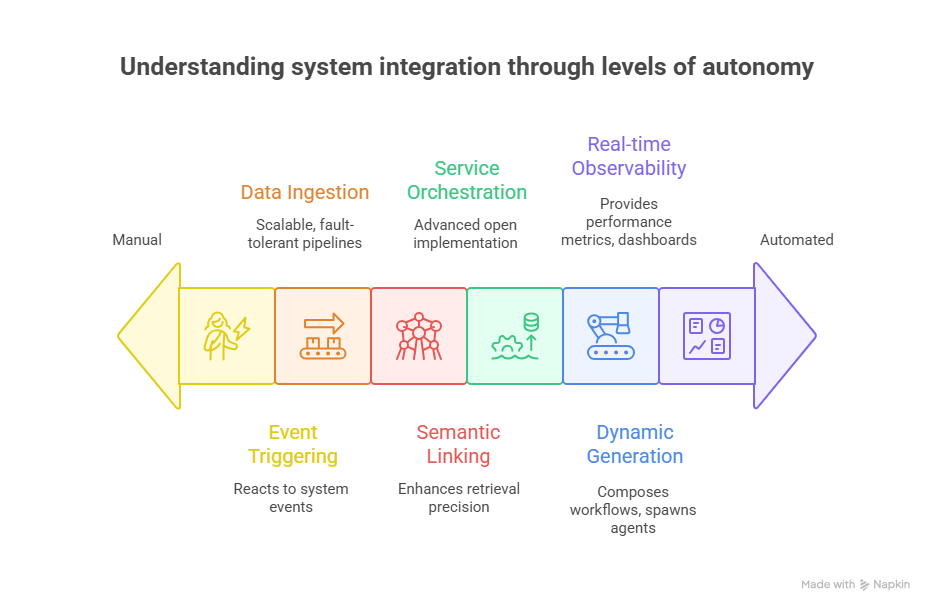

# 🌊 Tributary AI Services

**The open-source stream of intelligence powering next-gen RAG systems.**

Tributary AI Services is an open-source, modular ecosystem for building advanced Retrieval-Augmented Generation (RAG) applications. Designed for AI developers, ML engineers, and infrastructure teams, it brings together the essential components needed to create scalable, intelligent, and explainable AI pipelines.

---

## 🔍 What Is Tributary?

Tributary is a foundation for constructing powerful, production-ready RAG systems. Its components are built for flexibility, composability, and extensibility — supporting a wide range of workflows across ingestion, retrieval, orchestration, and generation.

Whether you're prototyping with local tools or deploying to production on cloud infrastructure, Tributary helps you build AI systems that learn, reason, and evolve.

---

## 🚀 Features & Roadmap

### ✅ Currently Available

- **DeepLake Integration**
  API bindings and SDK wrappers to interface with [DeepLake](https://activeloop.ai/) vector databases for fast, scalable retrieval.
  This provides an alternative to tightly linking Python libraries, reducing application size and opening DeepLake to developers using other programming languages

- **AudiModal Data Compliance Multimodal Ingest**
  Scalable, fault-tolerant ingestion pipelines with observability and multi-source support.
  If supports secure ingest and identified PII, HIPAA, GDPR, and many other compliance standards

### 🛠️ Coming Soon

- **Model Context Protocol (MCP)**
  An advanced open implementation, featuring a server registry and discovery mechanism for orchestrating model context services.

- **Knowledge Graph Integration**
  Semantic linking and graph-based enrichment to enhance retrieval precision and context depth.

- **Workflow & Agent Generation**
  Tools to compose multi-step workflows and spawn intelligent agents dynamically.

- **Analytics & Visualization**
  Real-time observability, performance metrics, and system-level dashboards for RAG-based applications.

---

## 🧩 Architecture Philosophy

Tributary is designed as a loosely coupled set of interoperable services. It follows cloud-native principles, supports modern orchestration platforms, and prioritizes:

- **Transparency** over black-box automation
- **Extensibility** through open protocols and registries
- **Scalability** via containerized, composable deployments
- **Community collaboration** as a first-class goal

---

## 🤝 Contributing

We welcome contributions! Tributary is in active development, and we’re looking for collaborators across:

- Vector and embedding support
- Protocol design (e.g., MCP extensions)
- Data ingestion connectors
- Visualization tools
- Knowledge graph utilities
- Docs & examples

Stay tuned for our contribution guide and community call schedule.

---

## 📜 License

Tributary AI Services is open-sourced under the [Apache 2.0 License](LICENSE).

---

## 🌐 Stay Connected

Follow the stream—join our community discussions and watch for updates:

- GitHub Discussions [Lets talk](https://github.com/orgs/Tributary-ai-services/discussions)
- Roadmap & releases on GitHub

---

*Build with the stream. Build with intelligence. Build with Tributary.*
